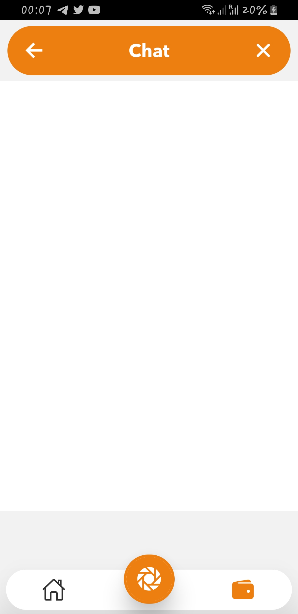

# Minor App
<!-- -->
<h1 align="center"></h1>

## Introduction
This is a demo application built with the goal to familarize and learn about react native.

Tested on Android only

## Technology and Architecture
React Native, Javascript

## Features

**Authenfication Screen:** Splash, Login, Register

**Home Screen:** App operations that can do

**Exchange Screen:** List of crypto exhanges

**Portofolio Screen:** Information of user, Button to show portofolio

**Chatbot Screen:** Chat with Dia bot, 

## Screenshots

### Login | Register

  
   
   

### Home | Exchange | Portofolio

  
   
   

### Chatbot | Chat

  
   

### Choose image | Solde

  
   

## Setup

#### Requirements
* Basic knowledge about ES6.
* Basic knowledge about JavaScript.
* Basic knowledge about React Native.
* Basic knowledge about Android and Android Studio.
* Android SDK Tools 23.0.5 or higher.
* Android version >= 5.0 (API level 21).

#### Project
1. Download or clone and open with e.g Visual Studio Code.
2. Make sur you have an emulator or a phone connected.
3. In your terminal:
    * If you have react-native cli installed globally, run `react-native run-android`
    * If you don't have it installed, run `npx react-native run-android`

## Help
If needed reach me on fassanebolly@gmail.com
